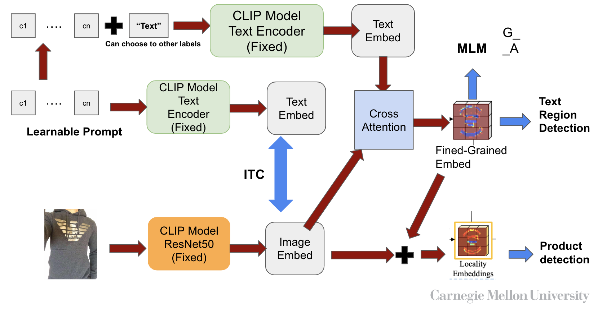

# Multimodal Project - Product10k
## Lab: Carnegie Mellon University - CyLab
## Author: Cheng An Hsieh
## 

## Requirements for evaluation
* python3.8
* cuda=11.3
* torch=1.10.2
* torchvision=0.11.3
* timm=0.9.10
* mmcv=2.0.1
* mmseg=1.2.1
* mmdet=3.1.0
* mmocr=1.0.1
* wandb

```bash=
conda create -n product python=3.8 pytorch=1.10 cudatoolkit=11.3 torchvision -c pytorch -y
conda activate product
pip3 install openmim
git clone https://github.com/open-mmlab/mmocr.git
cd mmocr
mim install -e .
cd ../
git https://github.com/chenganhsieh/MultimodalProduct.git
cd MultimodalProduct
pip install -r requirements.txt
wandb login
```

## Preprocess
1. Download icdar2015 dataset through .
2. Edit config: MultimodalProduct/configs/textdet/_base_/datasets/icdar2015.py
3. Edit config: MultimodalProduct/configs/textdet/dbnet/clip_db_r50_fpnc_prompt_gen_vis_1200e_ft_gen_ic15_adam_taiji.py

## Model Checkpoint
We train our model based on CLIP Resnet50. 
```bash=
bash ./pretrained/download.sh
```
## Fine-tune Multimodal model
* embeds_feats: average embedding or compute cls embedding
* pl_checkpoint: resume from checkpoint

## Train Model
```bash=
bash dist_train.sh configs/textdet/dbnet/clip_db_r50_fpnc_prompt_gen_vis_1200e_ft_gen_ic15_adam_taiji.py NUM_OF_GPUS
```

## Test Model
```bash=
bash dist_test.sh configs/textdet/dbnet/clip_db_r50_fpnc_prompt_gen_vis_1200e_ft_gen_ic15_adam_taiji.py NUM_OF_GPUS
```

### TODO
- [x] Add icdar2015 dataset
- [x] Add ctw1500 dataset
- [x] Add icdar2013 dataset
- [x] Add CLIP Model
- [x] Distributed training
- [x] Add contrastive learning loss
- [ ] Add MLM learning loss
- [ ] Add Product dataset
- [ ] Add Product detection
- [ ] Refactor and clean code
